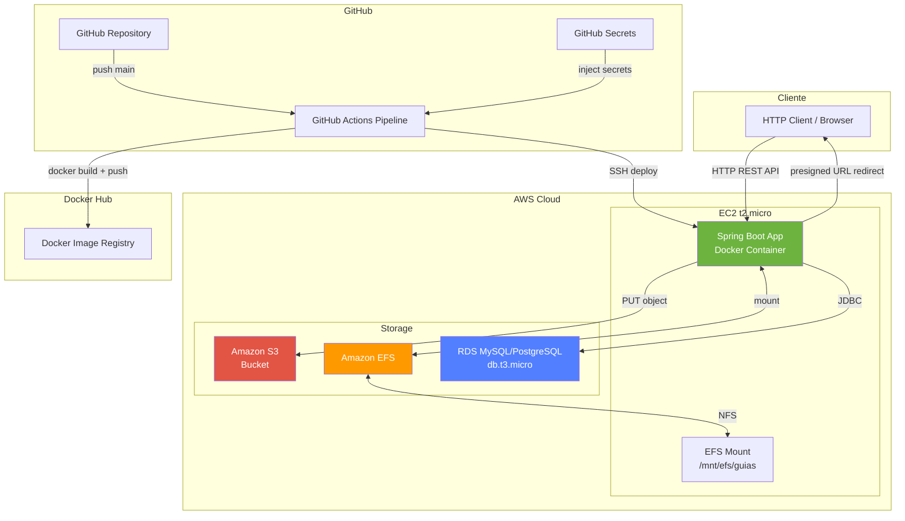
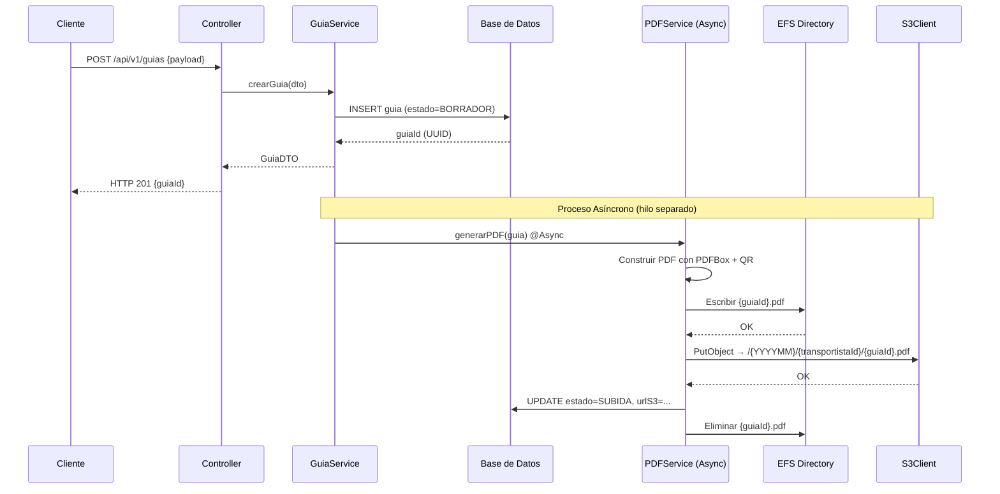
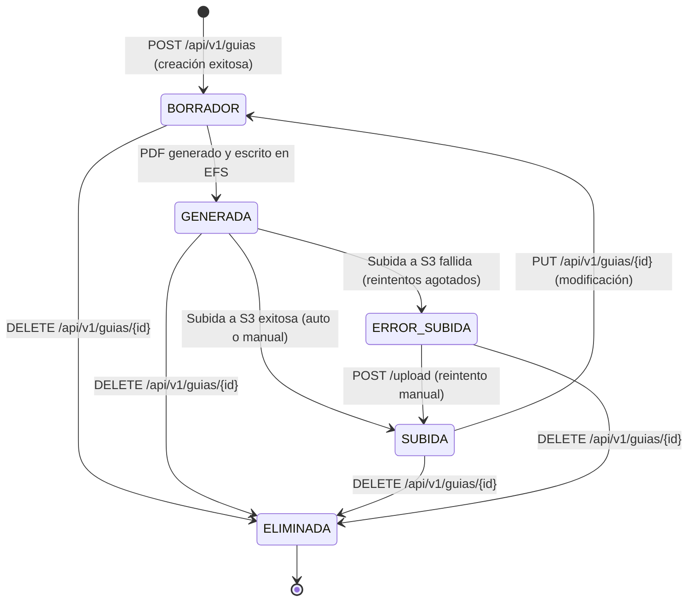

# Design Document

## Sistema de Gestión de Pedidos y Generación de Guías de Despacho

---

## Overview

El sistema es un microservicio REST construido con **Spring Boot (Java 17)** que gestiona el ciclo de vida completo de las Guías de Despacho: creación, generación asíncrona de PDF, almacenamiento temporal en EFS, persistencia en Amazon S3, descarga con control de acceso JWT, actualización y eliminación lógica. Se despliega en una instancia **EC2 t2.micro** mediante imágenes Docker publicadas en **Docker Hub**, con un pipeline CI/CD automatizado en **GitHub Actions**.

### Objetivos de Diseño

- **Bajo costo AWS**: Operar con menos de 30 créditos AWS mensuales en un entorno de pruebas usando la capa gratuita de EC2, S3 y RDS.
- **Alta disponibilidad para el contexto**: Despliegue en contenedor Docker con health checks y redespliegue automático.
- **Seguridad mínima viable**: Autenticación JWT stateless, roles `ADMIN` / `OPERADOR`, URLs pre-firmadas para descargas directas desde S3.
- **Mantenibilidad pedagógica**: Código comentado con Javadoc, README detallado, estructura de paquetes clara.
- **Procesamiento asíncrono de PDFs**: La creación de guías responde inmediatamente (HTTP 201); la generación del PDF y su subida a S3 ocurren en segundo plano.

---

## Architecture

### Diagrama de Arquitectura General



### Diagrama de Flujo de Creación y Generación de Guía



### Diagrama de Estados de una Guía



> **Nota de diseño**: El estado `BORRADOR` abarca tanto la guía recién creada (antes de que el PDF sea generado) como la guía cuyo PDF ya fue generado pero aún no subido a S3. Se añade el estado intermedio `GENERADA` para representar el PDF listo en EFS esperando ser subido.

---

## Components and Interfaces

### Estructura de Paquetes (Maven / Spring Boot)

```
com.transportista.guias/
├── config/
│   ├── AsyncConfig.java           # ThreadPoolTaskExecutor para @Async
│   ├── AwsS3Config.java           # S3Client bean (aws-sdk-java-v2)
│   ├── JwtSecurityConfig.java     # Spring Security + JWT filter chain
│   └── SwaggerConfig.java         # OpenAPI / Springdoc
├── controller/
│   └── GuiaController.java        # REST endpoints
├── dto/
│   ├── CrearGuiaRequestDTO.java
│   ├── GuiaResponseDTO.java
│   ├── GuiaListItemDTO.java
│   └── PaginatedResponseDTO.java
├── exception/
│   ├── GuiaNotFoundException.java
│   ├── GuiaYaEliminadaException.java
│   ├── GuiaNoDisponibleException.java
│   └── GlobalExceptionHandler.java
├── model/
│   └── Guia.java                  # Entidad JPA
├── repository/
│   └── GuiaRepository.java        # Spring Data JPA Repository
├── security/
│   ├── JwtAuthFilter.java
│   └── JwtUtil.java
├── service/
│   ├── GuiaService.java           # Lógica de negocio principal
│   ├── GuiaServiceImpl.java
│   ├── PdfGeneratorService.java   # Generación PDF con PDFBox
│   └── S3StorageService.java      # Operaciones S3
└── GuiasApplication.java
```

### Interfaces Principales

#### GuiaController — Endpoints REST

| Método | Ruta | Descripción | Auth requerida |
|--------|------|-------------|----------------|
| `POST` | `/api/v1/guias` | Crear guía de despacho | No (o Bearer token opcional) |
| `POST` | `/api/v1/guias/{guiaId}/upload` | Subida manual a S3 | Bearer token |
| `GET` | `/api/v1/guias/{guiaId}/download` | Descargar guía (redirect pre-signed URL) | Bearer token |
| `PUT` | `/api/v1/guias/{guiaId}` | Actualizar guía | Bearer token |
| `DELETE` | `/api/v1/guias/{guiaId}` | Eliminación lógica | Bearer token (rol ADMIN) |
| `GET` | `/api/v1/guias` | Consultar con filtros y paginación | Bearer token |
| `GET` | `/actuator/health` | Health check | No |

#### GuiaService — Contrato de Negocio

```java
/**
 * Servicio principal de gestión del ciclo de vida de las Guías de Despacho.
 */
public interface GuiaService {
    GuiaResponseDTO crearGuia(CrearGuiaRequestDTO dto);
    GuiaResponseDTO uploadGuia(UUID guiaId);
    void downloadGuia(UUID guiaId, String jwtToken, HttpServletResponse response);
    GuiaResponseDTO actualizarGuia(UUID guiaId, ActualizarGuiaRequestDTO dto);
    void eliminarGuia(UUID guiaId, String jwtToken);
    PaginatedResponseDTO<GuiaListItemDTO> consultarGuias(
        String transportistaId, String fecha, int page, int size);
}
```

#### S3StorageService — Operaciones AWS S3

```java
/**
 * Abstracción sobre AWS SDK v2 para operaciones con Amazon S3.
 */
public interface S3StorageService {
    String uploadFile(Path localPath, String s3Key) throws S3UploadException;
    void deleteObject(String s3Key);
    URL generatePresignedUrl(String s3Key, Duration validity);
}
```

#### PdfGeneratorService — Generación Asíncrona de PDF

```java
/**
 * Genera el PDF de una guía de forma asíncrona usando Apache PDFBox.
 * Escribe el resultado en EFS y dispara la subida a S3.
 */
public interface PdfGeneratorService {
    @Async("pdfExecutor")
    CompletableFuture<Void> generarYSubir(Guia guia);
}
```

### Configuración de Seguridad JWT

El filtro `JwtAuthFilter` intercepta todas las peticiones (excepto `/actuator/health` y `POST /api/v1/guias`), valida el token JWT del encabezado `Authorization: Bearer <token>` y carga el `SecurityContext` con los roles y el `transportistaId` del usuario. El claim `roles` del JWT debe incluir `ROLE_ADMIN` o `ROLE_OPERADOR`. El claim `transportistasPermitidos` es una lista de IDs de transportistas sobre los que el usuario tiene permiso de descarga.

```
JWT Claims esperados:
{
  "sub": "usuario@empresa.cl",
  "roles": ["ROLE_OPERADOR"],
  "transportistasPermitidos": ["T001", "T002"],
  "exp": 1700000000
}
```

---

## Data Models

### Entidad `Guia` (JPA / Base de Datos)

```java
@Entity
@Table(name = "guias")
public class Guia {
    @Id
    @GeneratedValue(strategy = GenerationType.UUID)
    @Column(name = "guia_id", updatable = false, nullable = false)
    private UUID guiaId;

    @Column(name = "transportista_id", nullable = false, length = 50)
    private String transportistaId;

    @Column(name = "fecha_envio", nullable = false)
    private LocalDate fechaEnvio;

    @Column(name = "destinatario", nullable = false, length = 255)
    private String destinatario;

    @Column(name = "direccion_destino", nullable = false, length = 500)
    private String direccionDestino;

    @Column(name = "peso_kg")
    private BigDecimal pesoKg;

    @Column(name = "descripcion_carga", length = 1000)
    private String descripcionCarga;

    @Column(name = "observaciones", length = 2000)
    private String observaciones;

    @Enumerated(EnumType.STRING)
    @Column(name = "estado", nullable = false, length = 20)
    private EstadoGuia estado;

    @Column(name = "url_s3", length = 1000)
    private String urlS3;

    @Column(name = "fecha_creacion", nullable = false, updatable = false)
    private Instant fechaCreacion;

    @Column(name = "fecha_actualizacion")
    private Instant fechaActualizacion;

    @Column(name = "eliminado", nullable = false)
    private boolean eliminado = false;
}
```

### Enum `EstadoGuia`

```java
public enum EstadoGuia {
    BORRADOR,       // Creada, PDF aún no generado o regenerando
    GENERADA,       // PDF generado en EFS, pendiente de subir a S3
    SUBIDA,         // PDF subido exitosamente a S3
    ERROR_SUBIDA,   // Subida a S3 falló tras reintentos
    ELIMINADA       // Soft delete aplicado
}
```

### Esquema SQL de Inicialización

```sql
CREATE TABLE guias (
    guia_id           CHAR(36)       NOT NULL PRIMARY KEY,
    transportista_id  VARCHAR(50)    NOT NULL,
    fecha_envio       DATE           NOT NULL,
    destinatario      VARCHAR(255)   NOT NULL,
    direccion_destino VARCHAR(500)   NOT NULL,
    peso_kg           DECIMAL(10,3),
    descripcion_carga VARCHAR(1000),
    observaciones     VARCHAR(2000),
    estado            VARCHAR(20)    NOT NULL DEFAULT 'BORRADOR',
    url_s3            VARCHAR(1000),
    fecha_creacion    TIMESTAMP      NOT NULL,
    fecha_actualizacion TIMESTAMP,
    eliminado         BOOLEAN        NOT NULL DEFAULT FALSE,
    INDEX idx_transportista_fecha (transportista_id, fecha_envio)
);
```

### DTOs de Request y Response

#### `CrearGuiaRequestDTO`

```json
{
  "transportistaId": "T001",
  "fechaEnvio": "2025-07-15",
  "destinatario": "Juan Pérez",
  "direccionDestino": "Av. Siempre Viva 742, Santiago",
  "pesoKg": 5.25,
  "descripcionCarga": "Electrónicos",
  "observaciones": "Frágil"
}
```

#### `GuiaResponseDTO` (HTTP 201 / 200)

```json
{
  "guiaId": "550e8400-e29b-41d4-a716-446655440000",
  "transportistaId": "T001",
  "fechaEnvio": "2025-07-15",
  "destinatario": "Juan Pérez",
  "direccionDestino": "Av. Siempre Viva 742, Santiago",
  "pesoKg": 5.25,
  "descripcionCarga": "Electrónicos",
  "observaciones": "Frágil",
  "estado": "BORRADOR",
  "urlS3": null,
  "fechaCreacion": "2025-07-15T10:30:00Z",
  "fechaActualizacion": null
}
```

#### `PaginatedResponseDTO` (GET /api/v1/guias)

```json
{
  "content": [
    {
      "guiaId": "...",
      "transportistaId": "T001",
      "fechaEnvio": "2025-07-15",
      "estado": "SUBIDA",
      "urlS3": "https://bucket.s3.amazonaws.com/202507/T001/550e8400.pdf",
      "fechaCreacion": "2025-07-15T10:30:00Z"
    }
  ],
  "totalElements": 42,
  "totalPages": 3,
  "currentPage": 0,
  "pageSize": 20
}
```

### Configuración de Variables de Entorno

| Variable | Descripción | Ejemplo | Obligatoria |
|----------|-------------|---------|-------------|
| `AWS_ACCESS_KEY_ID` | Clave de acceso AWS | `AKIA...` | Sí (prod) |
| `AWS_SECRET_ACCESS_KEY` | Clave secreta AWS | `wJalr...` | Sí (prod) |
| `AWS_REGION` | Región AWS | `us-east-1` | Sí |
| `S3_BUCKET_NAME` | Nombre del bucket S3 | `guias-despacho-prod` | Sí |
| `EFS_MOUNT_PATH` | Ruta del directorio EFS montado | `/mnt/efs/guias` | Sí |
| `DB_URL` | URL JDBC de la base de datos | `jdbc:mysql://rds-host:3306/guiasdb` | Sí |
| `DB_USERNAME` | Usuario de base de datos | `guias_user` | Sí |
| `DB_PASSWORD` | Contraseña de base de datos | `s3cret` | Sí |
| `JWT_SECRET` | Clave secreta para validar JWT (HS256) | `mySecretKey...` | Sí |
| `PDF_ASYNC_POOL_SIZE` | Tamaño del thread pool para PDF | `4` | No (defecto: 4) |

---

## Correctness Properties

*Una propiedad es una característica o comportamiento que debe mantenerse verdadero en todas las ejecuciones válidas del sistema — esencialmente, un enunciado formal sobre lo que el sistema debe hacer. Las propiedades sirven como puente entre especificaciones legibles por humanos y garantías de corrección verificables por máquinas.*

Las propiedades a continuación fueron derivadas del análisis de los criterios de aceptación. Las siguientes propiedades están implementadas como pruebas jqwik con mínimo 100 iteraciones cada una:

- Properties 1, 3, 4, 5 → validación de la lógica de creación de guías
- Property 2 → validación de la construcción de rutas S3 (función pura)
- Property 6 → validación de la lógica de actualización
- Properties 7, 8, 9 → invariantes matemáticos y de filtrado de la paginación
- Property 10 → validación de la generación de PDF

**Reflexión de propiedades aplicada**: La Property 7 (content.size() ≤ pageSize) y la Property 9 (metadatos consistentes) se consolidaron en una sola propiedad de paginación comprensiva (Property 8), ya que la segunda implica a la primera. Las properties de validación de inputs (2, 3, 4) se mantienen separadas porque testean ramas de validación independientes del código.

---

### Property 1: Creación con datos válidos siempre produce guía con estado BORRADOR y guiaId UUID v4 único

*Para cualquier* combinación válida de `transportistaId` (alfanumérico, ≤ 50 chars), `fechaEnvio` (formato `YYYY-MM-DD`), `destinatario` (no vacío) y `direccionDestino` (no vacío), la operación de creación debe devolver HTTP 201 con un `guiaId` de formato UUID v4 y estado `BORRADOR`. Además, para cualquier par de guías creadas con datos válidos, sus `guiaId` deben ser distintos.

**Validates: Requirements 3.1, 3.3, 3.6**

---

### Property 2: La ruta S3 se construye correctamente para cualquier guía válida

*Para cualquier* combinación de `fechaEnvio` válida (fecha ISO 8601), `transportistaId` alfanumérico y `guiaId` UUID v4, la función de construcción de ruta S3 debe producir exactamente la cadena `/{YYYYMM}/{transportistaId}/{guiaId}.pdf`, donde `YYYYMM` es el año y mes de `fechaEnvio` con cero a la izquierda si el mes es de un dígito.

**Validates: Requirements 2.1**

---

### Property 3: Campos obligatorios faltantes siempre producen HTTP 400 con lista de campos

*Para cualquier* payload de creación donde al menos uno de los campos `transportistaId`, `fechaEnvio`, `destinatario` o `direccionDestino` esté ausente o sea `null`, el sistema debe devolver HTTP 400 y el mensaje de error debe enumerar todos los campos faltantes (no solo el primero).

**Validates: Requirements 3.2**

---

### Property 4: Validación de formato y restricciones de campos individuales

*Para cualquier* string que represente una `fechaEnvio` que no cumpla el formato `YYYY-MM-DD` (incluyendo strings vacíos, fechas en otros formatos, texto arbitrario), el sistema debe devolver HTTP 400. De igual forma, *para cualquier* `transportistaId` que contenga al menos un carácter no alfanumérico o que tenga longitud mayor a 50 caracteres, el sistema debe devolver HTTP 400.

**Validates: Requirements 3.4, 3.5**

---

### Property 5: Campos no permitidos en actualización siempre producen HTTP 400

*Para cualquier* payload de actualización (PUT) que incluya al menos un campo distinto a `{destinatario, direccionDestino, pesoKg, descripcionCarga, observaciones}`, el sistema debe devolver HTTP 400, independientemente de si los valores de los campos válidos son correctos.

**Validates: Requirements 6.2**

---

### Property 6: Consulta paginada respeta invariantes matemáticos y excluye eliminadas

*Para cualquier* consulta válida con filtros de `transportistaId` y `fecha`, y parámetros de paginación `page` y `size` dentro del rango permitido (0 ≤ page, 1 ≤ size ≤ 100):
1. `content.size() ≤ size`
2. `totalPages = ceil(totalElements / size)` (o 0 si `totalElements = 0`)
3. Ningún elemento de `content` tiene estado `ELIMINADA`

**Validates: Requirements 8.1, 8.6, 8.7**

---

### Property 7: Parámetros de paginación fuera de rango siempre producen HTTP 400

*Para cualquier* combinación de parámetros donde `size > 100`, o `page < 0`, o `size < 1`, el sistema debe devolver HTTP 400, independientemente de los valores de `transportistaId` y `fecha`.

**Validates: Requirements 8.8, 8.9**

---

### Property 8: Validación de parámetros obligatorios de consulta

*Para cualquier* solicitud GET a `/api/v1/guias` que omita el parámetro `transportistaId`, el sistema debe devolver HTTP 400. *Para cualquier* valor del parámetro `fecha` que no cumpla el formato `YYYYMM` con mes en rango 01–12 (incluyendo strings vacíos, letras, meses fuera de rango), el sistema debe devolver HTTP 400.

**Validates: Requirements 8.4, 8.5**

---

### Property 9: Round-trip de serialización de GuiaResponseDTO

*Para cualquier* objeto `Guia` válido persistido en base de datos, convertir a `GuiaResponseDTO` (serialización a JSON) y luego deserializar ese JSON a un nuevo `GuiaResponseDTO` debe producir un objeto con los mismos valores en todos sus campos (`guiaId`, `transportistaId`, `fechaEnvio`, `destinatario`, `direccionDestino`, `estado`, `urlS3`, `fechaCreacion`, `fechaActualizacion`).

**Validates: Requirements 3.1, 3.6, 8.2**

---

### Property 10: El PDF generado contiene todos los campos requeridos de la guía

*Para cualquier* instancia de `Guia` con datos válidos (`guiaId`, `transportistaId`, `fechaEnvio`, `destinatario`, `direccionDestino`, y opcionalmente `pesoKg`, `descripcionCarga`, `observaciones`), el documento PDF generado por `PdfGeneratorService` debe contener como texto legible los valores de los campos obligatorios: `guiaId`, `transportistaId`, `fechaEnvio`, `destinatario` y `direccionDestino`. Si `observaciones` está presente, también debe aparecer en el PDF.

**Validates: Requirements 11.1, 11.5**

---

## Error Handling

### Mapa Global de Errores HTTP

| Escenario | Código HTTP | Mensaje |
|-----------|------------|---------|
| Campos obligatorios faltantes en creación | 400 | Lista de campos faltantes |
| `fechaEnvio` con formato incorrecto | 400 | "El campo fechaEnvio debe tener el formato YYYY-MM-DD" |
| `transportistaId` inválido | 400 | Mensaje de restricción |
| Campos no permitidos en PUT | 400 | "El cuerpo contiene campos no permitidos para modificación" |
| `size` > 100 | 400 | "El parámetro size no puede superar el valor de 100" |
| Parámetros de paginación negativos | 400 | "Los parámetros de paginación deben ser valores positivos" |
| JWT ausente, expirado o firma inválida | 401 | "Token de autenticación inválido o expirado" |
| Sin permiso de descarga para transportistaId | 403 | "No tiene permisos para descargar esta guía" |
| Sin rol ADMIN para eliminar | 403 | "No tiene permisos para eliminar guías" |
| Guía no encontrada | 404 | "Guía no encontrada" |
| Archivo PDF no en EFS | 404 | "Archivo PDF no encontrado en almacenamiento temporal" |
| Guía ya subida (intento de re-upload) | 409 | "La guía ya ha sido subida a S3" |
| Guía en estado ELIMINADA (upload) | 409 | "No es posible subir una guía eliminada" |
| Guía en estado ELIMINADA (modificación) | 409 | "No es posible modificar una guía eliminada" |
| Guía ya eliminada (DELETE) | 409 | "La guía ya ha sido eliminada" |
| Guía no disponible para descarga | 409 | "La guía no está disponible para descarga" |
| Error al persistir guía en DB | 500 | "Error al persistir la guía" |
| Error de escritura en EFS | 500 | `guiaId` + descripción del fallo |
| Error de subida a S3 (reintentos agotados) | 502 | Detalle del error S3 |
| Error al generar URL pre-firmada | 502 | "Error al generar enlace de descarga" |

### Estrategia de Reintentos S3

Se implementa con Spring Retry (`@Retryable`) sobre el método `uploadFile` de `S3StorageService`:

```java
@Retryable(
    value = {SdkClientException.class, S3Exception.class},
    maxAttempts = 3,
    backoff = @Backoff(delay = 2000)
)
public String uploadFile(Path localPath, String s3Key) { ... }

@Recover
public String recoverUpload(Exception e, Path localPath, String s3Key) {
    // Actualiza estado a ERROR_SUBIDA, lanza S3UploadException
}
```

Los errores no reintentables (e.g., `NoSuchBucketException`) se manejan lanzando la excepción directamente sin pasar por el mecanismo de reintento.

### Manejo de Errores en el Proceso Asíncrono

El `PdfGeneratorService` opera en un hilo separado (`@Async`). Los errores en este contexto no pueden ser devueltos al cliente HTTP. Se maneja así:

1. **Error en generación de PDF**: Registra `ERROR` en log con `guiaId` y causa. La guía permanece en `BORRADOR`.
2. **Error en escritura EFS**: Registra `ERROR` en log. La guía permanece en `BORRADOR`.
3. **Error en subida S3 (async)**: Actualiza estado a `ERROR_SUBIDA`. Registra en log.
4. **Error en eliminación EFS post-subida**: Registra `WARN` en log. No revierte estado `SUBIDA`.

El `GlobalExceptionHandler` (`@RestControllerAdvice`) centraliza el manejo de excepciones en la capa de controlador.

---

## Testing Strategy

### Enfoque Dual de Pruebas

El proyecto combina **pruebas unitarias basadas en ejemplos** y **pruebas basadas en propiedades (Property-Based Testing)** para lograr cobertura exhaustiva de la lógica de negocio.

### Herramientas

| Herramienta | Propósito |
|-------------|-----------|
| JUnit 5 | Framework base de pruebas |
| Mockito | Mocking de dependencias |
| jqwik | Property-based testing para Java |
| Spring Boot Test | Pruebas de integración con contexto Spring |
| H2 (in-memory) | Base de datos para pruebas locales |
| LocalStack | Simulación de S3 en local para pruebas de integración |
| Testcontainers | Contenedor LocalStack en pruebas de integración |
| MockMvc | Pruebas de controladores REST |

### Property-Based Testing con jqwik

Las propiedades definidas en la sección "Correctness Properties" se implementan como pruebas jqwik con mínimo **100 iteraciones** cada una. Cada prueba se etiqueta con:

```
// Feature: sistema-gestion-guias-despacho, Property N: <texto de la propiedad>
```

Ejemplo de estructura de prueba de propiedad:

```java
// Feature: sistema-gestion-guias-despacho, Property 2: Validación de campos obligatorios
@Property(tries = 200)
void validacionCamposObligatorios(@ForAll @From("payloadsConCampoFaltante") CrearGuiaRequestDTO dto) {
    // Arrange
    // Act
    ResponseEntity<ErrorResponseDTO> resp = controller.crearGuia(dto);
    // Assert
    assertThat(resp.getStatusCode()).isEqualTo(HttpStatus.BAD_REQUEST);
}
```

### Pruebas Unitarias (Ejemplo-Based)

- **GuiaServiceImpl**: Verificar flujo happy path de creación, modificación, eliminación y consulta usando Mockito.
- **JwtAuthFilter**: Verificar tokens válidos, expirados y con firma inválida con ejemplos concretos.
- **PdfGeneratorService**: Verificar que el PDF contiene los campos requeridos con una guía de ejemplo.
- **S3StorageService**: Verificar construcción de rutas S3 con ejemplos de fechas y transportistaIds.

### Pruebas de Integración

- Levantar `LocalStack` con `Testcontainers` para validar el flujo completo de subida/descarga S3.
- Usar base de datos H2 en memoria para validar repositorios JPA.
- Verificar endpoint `/actuator/health` devuelve HTTP 200.

### Pruebas de Humo (Smoke Tests)

- Verificar que la aplicación inicia correctamente con configuración mínima.
- Verificar que el bucket S3 configurado en `S3_BUCKET_NAME` es accesible.

### Cobertura Objetivo

- Cobertura de líneas en `service/`: ≥ 80%
- Cobertura de líneas en `controller/`: ≥ 70%
- Todas las propiedades de corrección implementadas como pruebas jqwik

---

## Infrastructure and Deployment

### Dockerfile

```dockerfile
FROM eclipse-temurin:17-jre-alpine
WORKDIR /app
COPY target/guias-despacho-*.jar app.jar
EXPOSE 8080
ENTRYPOINT ["java", "-jar", "app.jar"]
```

### docker-compose.yml (Desarrollo Local)

```yaml
version: '3.9'
services:
  app:
    build: .
    ports:
      - "8080:8080"
    environment:
      - EFS_MOUNT_PATH=/tmp/efs-local
      - S3_BUCKET_NAME=guias-local
      - AWS_ACCESS_KEY_ID=test
      - AWS_SECRET_ACCESS_KEY=test
      - AWS_REGION=us-east-1
      - AWS_ENDPOINT_OVERRIDE=http://localstack:4566
      - DB_URL=jdbc:h2:mem:guiasdb;DB_CLOSE_DELAY=-1
      - DB_USERNAME=sa
      - DB_PASSWORD=
      - JWT_SECRET=dev-secret-key-min-32-chars-long!!
    depends_on:
      - localstack

  localstack:
    image: localstack/localstack:3.0
    ports:
      - "4566:4566"
    environment:
      - SERVICES=s3
      - DEFAULT_REGION=us-east-1
```

### GitHub Actions Pipeline

```yaml
# .github/workflows/ci-cd.yml
name: CI/CD Pipeline

on:
  push:
    branches: [main]

jobs:
  test-build-push:
    runs-on: ubuntu-latest
    steps:
      - uses: actions/checkout@v4
      - uses: actions/setup-java@v4
        with:
          java-version: '17'
          distribution: 'temurin'
      - name: Run Tests
        run: mvn test
      - name: Build & Push Docker Image
        uses: docker/build-push-action@v5
        with:
          push: true
          tags: |
            ${{ secrets.DOCKERHUB_USERNAME }}/guias-despacho:latest
            ${{ secrets.DOCKERHUB_USERNAME }}/guias-despacho:${{ github.sha | cut -c1-7 }}

  deploy-ec2:
    needs: test-build-push
    runs-on: ubuntu-latest
    steps:
      - name: Deploy to EC2
        uses: appleboy/ssh-action@v1
        with:
          host: ${{ secrets.EC2_HOST }}
          username: ${{ secrets.EC2_USER }}
          key: ${{ secrets.EC2_SSH_KEY }}
          retry_count: 3
          retry_wait: 30
          script: |
            docker pull ${{ secrets.DOCKERHUB_USERNAME }}/guias-despacho:latest
            docker stop guias-app || true
            docker rm guias-app || true
            docker run -d --name guias-app -p 8080:8080 \
              -e AWS_ACCESS_KEY_ID=${{ secrets.AWS_ACCESS_KEY_ID }} \
              -e AWS_SECRET_ACCESS_KEY=${{ secrets.AWS_SECRET_ACCESS_KEY }} \
              -e AWS_REGION=${{ secrets.AWS_REGION }} \
              -e S3_BUCKET_NAME=${{ secrets.S3_BUCKET_NAME }} \
              -e EFS_MOUNT_PATH=/mnt/efs/guias \
              -v /mnt/efs:/mnt/efs \
              -e DB_URL=${{ secrets.DB_URL }} \
              -e DB_USERNAME=${{ secrets.DB_USERNAME }} \
              -e DB_PASSWORD=${{ secrets.DB_PASSWORD }} \
              -e JWT_SECRET=${{ secrets.JWT_SECRET }} \
              ${{ secrets.DOCKERHUB_USERNAME }}/guias-despacho:latest
            sleep 60
            curl --fail http://localhost:8080/actuator/health
```

### Estimación de Costos AWS (Entorno de Pruebas)

| Servicio | Configuración | Costo estimado/mes |
|----------|--------------|-------------------|
| EC2 t2.micro | 750 h/mes (capa gratuita primer año) | $0 |
| S3 Standard | < 5 GB almacenados | $0 (capa gratuita) |
| RDS db.t3.micro | 750 h/mes (capa gratuita primer año) | $0 |
| EFS Infrequent Access | < 1 GB (limpieza tras subida S3) | ~$0.03 |
| Transferencia de datos | Mínima con URLs pre-firmadas S3 | ~$0.09 |
| **Total estimado** | | **< $1 / mes** |

> Con LocalStack para desarrollo local, el consumo de créditos AWS queda restringido al ambiente de producción en EC2.

---

## Design Decisions and Rationale

### Decisión 1: Procesamiento Asíncrono de PDFs con @Async

**Decisión**: La generación del PDF y la subida a S3 se ejecutan en un hilo separado del pool `pdfExecutor` usando `@Async` de Spring.

**Rationale**: La generación de PDFs con PDFBox puede tomar varios segundos dependiendo del contenido. Bloquear la respuesta HTTP haría la API lenta bajo carga. Al responder inmediatamente con HTTP 201 y el `guiaId`, el cliente puede consultar el estado de la guía para saber cuándo está lista.

**Trade-off**: Los errores de generación PDF/subida S3 no son visibles en la respuesta de creación; requieren consultar el estado de la guía.

### Decisión 2: Estado GENERADA como estado intermedio

**Decisión**: Se añade el estado `GENERADA` entre `BORRADOR` y `SUBIDA` para representar que el PDF está en EFS listo para subir.

**Rationale**: Permite distinguir entre "PDF no generado aún" (BORRADOR) y "PDF generado esperando subida" (GENERADA), lo que facilita el diagnóstico de problemas y la lógica del endpoint `/upload`.

### Decisión 3: jqwik como librería PBT para Java

**Decisión**: Se usa [jqwik](https://jqwik.net/) sobre otras alternativas como QuickTheories o Hypothesis (Python).

**Rationale**: jqwik integra nativamente con JUnit 5 (el estándar en Spring Boot), tiene soporte activo, anotaciones intuitivas (`@Property`, `@ForAll`) y es la librería PBT más madura del ecosistema Java.

### Decisión 4: URL Pre-firmada S3 para descargas (HTTP 302 Redirect)

**Decisión**: El endpoint de descarga devuelve HTTP 302 con la URL pre-firmada S3 en el header `Location`.

**Rationale**: Evita que el tráfico de descarga (archivos PDF) pase por EC2, eliminando costos de transferencia de datos de salida y evitando saturar la instancia t2.micro.

### Decisión 5: Soft Delete (Eliminación Lógica)

**Decisión**: Las guías eliminadas cambian su estado a `ELIMINADA` en lugar de eliminarse físicamente de la base de datos.

**Rationale**: Permite auditoría, recuperación ante errores accidentales y cumple con políticas de retención de datos. La consulta filtra automáticamente los registros `ELIMINADA`.

### Decisión 6: H2 en local / RDS en producción

**Decisión**: La configuración de Spring Boot usa perfiles: `local` con H2 in-memory y `prod` con RDS MySQL/PostgreSQL.

**Rationale**: H2 no requiere infraestructura adicional para desarrollo y pruebas, reduciendo el consumo de créditos AWS. En producción, RDS ofrece durabilidad y backups automáticos dentro de la capa gratuita.
